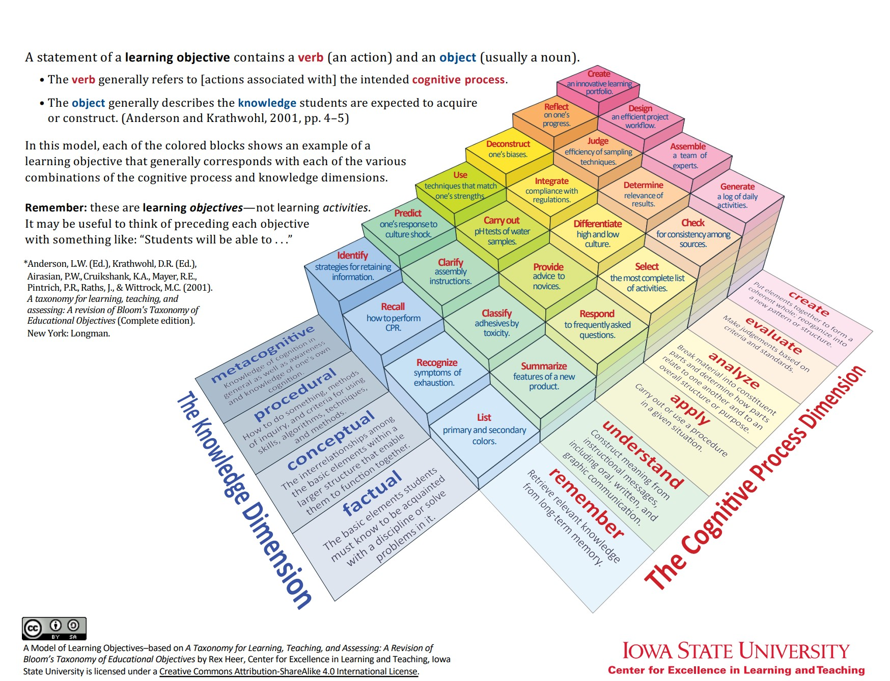

---
# Title, summary, and page position.
linktitle: CMU test
summary: move AoL packet 
weight: 2
icon: book
icon_pack: fas

# Page metadata.
title: 
date: "2018-09-09T00:00:00Z"
type: book  # Do not modify.
---

**Drafting Course Learning Objectives (CLOs)**

This document should give an overview and list of recommended resources. 

Course learning objectives (CLOs) are statements that make explicit the skill or knowledge that students are expected to learn as they complete a course. They measurable and more specific than learning goals or competency goals. Competency goals are broader and can encompass numerous objectives. 

At CBA we will standardize on using the term Course Learning Objective (CLO) and Student Learning Outcome (SLO) interchangeably. With preference given to Course Learning Goals. We will also standardize around the revised Bloom’s taxonomy (Anderson et. al, 2001) in writing course learning goals. 

The objective statement is a simple statement containing two parts: 
1. The verb: Describes the action associated with the learning process (e.g., acquire, analyze, list ..etc) 
2. The object: Describes the knowledge that the student is expected to learn. 

For example: 
1. **Identify** strategies for retaining information. 
2. **Apply** excel in solving linear programming problems 
3. **Develop** a product marketing strategy 

The verb is highlighted in the examples and is key in describing the learning process. The unhighlighted part of the statement is the object which describes the knowledge domain. 

Verbs are categorized into six categories that represent a continuum representing simple knowledge acquisition processes that students would start with and increasing with complexity. The categories in order of simplicity are:
1. Remember
2. Understand 
3. Apply 
4. Analyze 
5. Evaluate 
6. Create 

Writing a learning goal typically starts with selecting the right verb to describe the learning process. With 100 level courses typically using verbs from simple categories like remember and understand and senior undergraduate courses using more complex categories such as apply an analyze. Graduate level courses by nature will use more complex categories such as analyze, evaluate, and create.  

After selecting the verb, the object (or knowledge domain) is chosen from 4 different categories ranging from concrete factual to highly abstract metacognitive domain: 
1. Factual: Basic elements of knowledge or facts that a student must learn. 
2. Conceptual: The interrelationships among basic elements and how they might function together 
3. Procedural: How to do something. 
4. Metacognitive: Knowledge or awareness about cognition or one’s own knowledge. 

Care should be taken when choosing verbs that they fit both the learning process and knowledge domain. The following graph shows the most appropriate verb to use based on the learning process and knowledge domain: 

